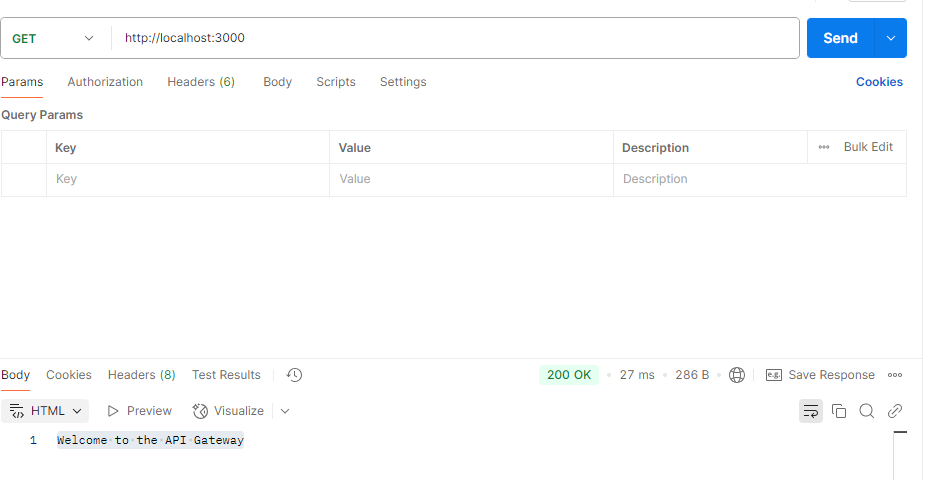
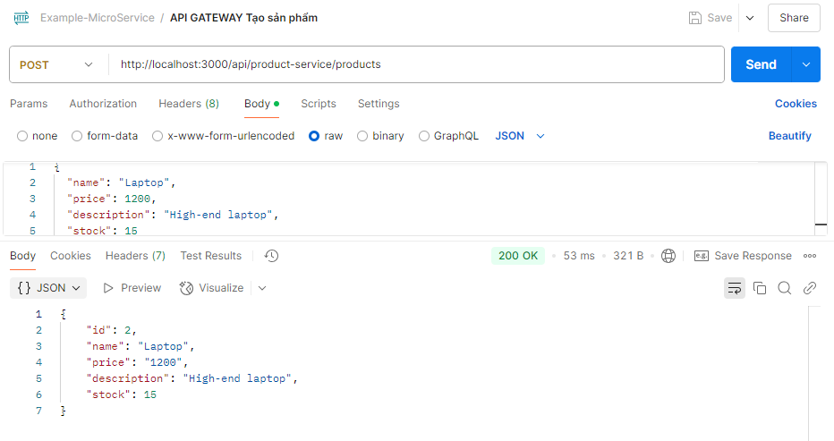
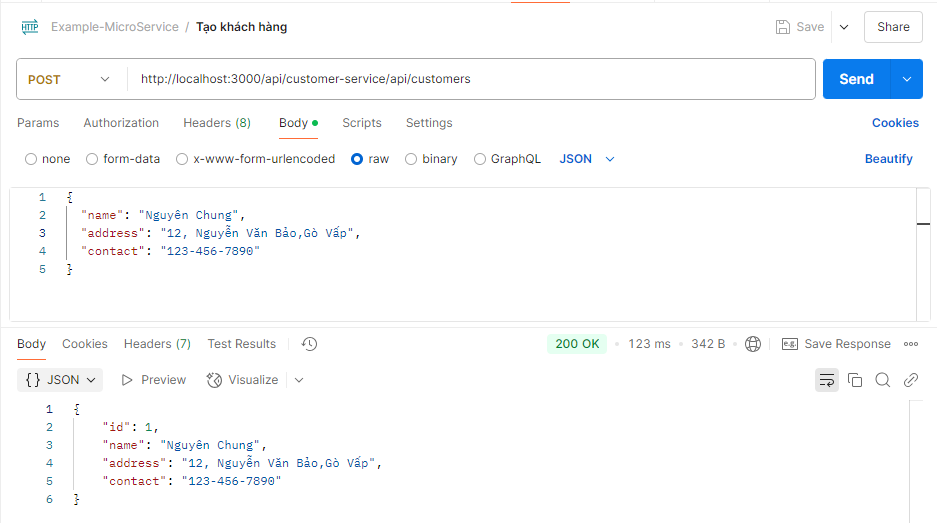
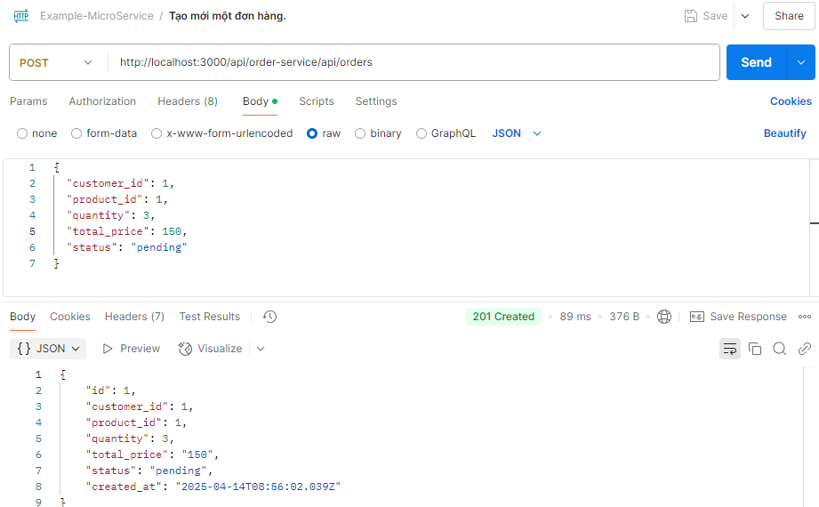

# Sales Microservices System

1. chạy lệnh docker

```
docker-compose up --build
```

2. Test API qua gateway (localhost:3000)
   
   2.1 tạo product
   
   2.2 Tạo khách hàng
   
   2.3 Tạo đơn
   
